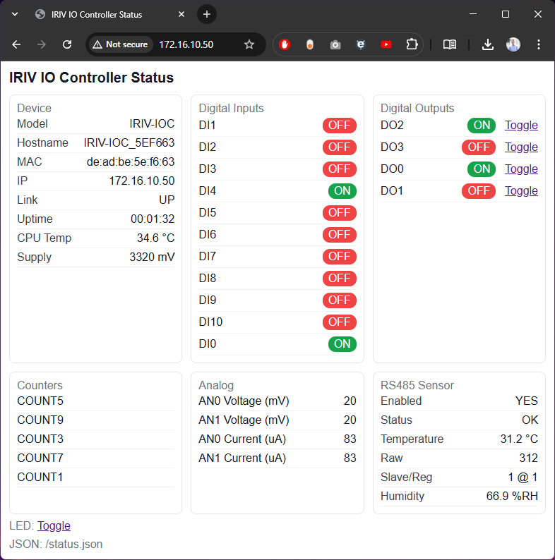

# MODBUS RTU/TCP IO Expander Example Code
This is the example code for using the IRIV IO Controller (IRIV-IOC) as a IO Expander Module. The code is written in CircuitPython and support the following features:
- MODBUS RTU (RS485) and MODBUS TCP (Ethernet) Compatible<br>It's configured as TCP mode by default and can be changed in the `settings.toml` file
- 11x Digital Inputs (5 of them can be configured as counter)
- 4x Digital Outpus
- 2x Analog Inputs (0-10V or 0-40mA)
- Web UI dashboard (HTML + JSON) for live status and control, with optional RS485 temperature/humidity sensor integration



## Setting Up
1. Load the IRIV IO Controller with the latest CircuitPython Firmware. It can be downloaded from [here](https://circuitpython.org/board/cytron_iriv_io_controller/).
2. Connect the controller via USB-C. A USB drive called `CIRCUITPY` should show up.
3. Copy all files from the `source` folder to the `CIRCUITPY` drive:
   - `source/code.py`
   - the entire `source/lib/` directory
   - `source/settings.toml`
4. Install required libraries into `CIRCUITPY/lib/` (from the Adafruit CircuitPython Bundle matching your firmware):
   - `adafruit_wiznet5k/`
   - `adafruit_bus_device/`
   - `adafruit_httpserver/`
5. Reboot the controller. The blue USR LED should be blinking if the code is running correctly (for MODBUS TCP, USR LED turns on when the code is running and blinks when the Ethernet link is up).

## MODBUS RTU Configuration
1. Connect the IRIV-IOC to the computer via USB-C. A CIRCUITPY drive should be detected.
2. Edit the `settings.toml` file in the CIRCUITPY drive and make sure `MODBUS_MODE = "RTU"`.<br>
We can also change the RS485 Baudrate and MODBUS RTU slave ID.<br>
```
# MODBUS Mode ("RTU" or "TCP").
MODBUS_MODE = "RTU"

"""
These configurations are only for MODBUS RTU.
"""

# Baudrate for RS485.
# Maximum baudrate = 115200.
MODBUS_RTU_BAUDRATE = 9600

# MODBUS RTU Slave ID/Address.
# Valid Range = 1 to 247.
MODBUS_RTU_SLAVE_ADDRESS = 1
```
3. Save the file and **reboot**.

## MODBUS TCP Configuration
1. Connect the IRIV-IOC to the computer via USB-C. A CIRCUITPY drive should be detected.
2. Edit the `settings.toml` file in the CIRCUITPY drive and make sure `MODBUS_MODE = "TCP"`.<br>
```
# MODBUS Mode ("RTU" or "TCP").
MODBUS_MODE = "TCP"
```
3. Scroll down to the MODBUS TCP section, we can change the settings and assign static IP for the IRIV-IOC too.<br>
```
"""
These configurations are only for MODBUS TCP.
"""

# Get IP from DHCP Server (1=Yes or 0=No)?
# If NO, we need to set the IP Address, Subnet Mask, Gateway Address and DNS Address manually.
DHCP = 1

# IP Adress (Ignored if DHCP = True)
IP_ADDRESS = "10.0.0.2"

# Subnet Mask (Ignored if DHCP = True)
SUBNET_MASK = "255.255.255.0"

# Gateway Address (Ignored if DHCP = True)
GATEWAY_ADDRESS = "0.0.0.0"

# DNS Server Address (Ignored if DHCP = True)
DNS_SERVER = "8.8.8.8"
```
4. Save the file and **reboot**.

***Note:*** *The MODBUS TCP slave ID is fixed as `0xFF (255)`. Use the IP address instead to communicate with different MODBUS TCP slave.*

***Disclaimer:*** *Due to the limitation of circuitpython, the typical response time for MODBUS TCP is around 20ms.*

### Verifying Modbus RTU
- Set `MODBUS_MODE = "RTU"` in `settings.toml`, and configure `MODBUS_RTU_BAUDRATE` and `MODBUS_RTU_SLAVE_ADDRESS`.
- Using a Modbus RTU master over RS485, test:
  - Coils (0x01): DO0–DO3 at 0x0100–0x0103
  - Discrete Inputs (0x02): DI0–DI10 at 0x0000–0x000A
  - Input Registers (0x04): ANV0/ANV1 at 0x0200–0x0201, ANA0/ANA1 at 0x0210–0x0211, Counters at 0x0400–0x0409
  - Write Single Coil (0x05) and Write Multiple Coils (0x0F): toggle DOx
  - Write Single Register (0x06) / Write Multiple Registers (0x10): supported by stack; not used for analog in this example

### Verifying Modbus TCP
- Set `MODBUS_MODE = "TCP"` and connect Ethernet. On boot, the console shows MAC/IP.
- Use any Modbus TCP master against port 502 with the same register map as above.
- The Web UI is separate from Modbus TCP; both run concurrently.

## Web Interface (TCP mode)
A lightweight web dashboard is available when running in MODBUS TCP mode. It shows:
- Device info: model, hostname, MAC, IP, link status, uptime, CPU temp, supply voltage (mV)
- IO status: DI0–DI10, DO0–DO3
- Counters (if enabled): DI1/3/5/7/9 counts
- Analog readings: AN0/AN1 voltage (mV) and current (µA)

Endpoints:
- `http://<device-ip>/` – HTML dashboard (auto-refresh)
- `http://<device-ip>/status.json` – JSON payload

Settings in `settings.toml`:
```
# Simple Web Server (only in MODBUS TCP mode)
WEBSERVER_ENABLE = 1      # 1=enable, 0=disable
WEBSERVER_PORT = 80       # HTTP port
WEBSERVER_REFRESH_SEC = 5 # HTML auto-refresh interval (seconds)
```

Required libraries on the CIRCUITPY drive (in `/lib`):
- `adafruit_wiznet5k/`
- `adafruit_bus_device/`
- `adafruit_httpserver/`

After copying the libraries and source files, press the reset button or hit Ctrl-D on the serial console.

### Digital Outputs (DO0–DO3)
- What they are: transistorized industrial outputs; typically sink current to GND (low‑side). They are not 3.3 V logic pins for directly powering an LED.
- Web control: The dashboard shows each DO with a Toggle link. Clicking toggles the output and updates the associated Modbus coil register so external masters see the change.
- Wiring example (sinking load):
  - External supply V+ → series resistor → LED anode → LED cathode → DOx terminal
  - IOC GND → supply GND
  - When DOx is ON, it sinks to GND, lighting the LED.
- Safety: Start with small loads and correct polarity. Use appropriate series resistors or relay inputs per your device’s spec.

### Pulse Counters (DI1, DI3, DI5, DI7, DI9)
These inputs can count falling-edge pulses instead of reporting simple ON/OFF.
- Use cases: flow meters, RPM sensors, energy meter pulse outputs, push-button press counts.
- Behavior:
  - When a counter is enabled on a channel, that channel’s discrete input value is suppressed and a 32‑bit counter value is exposed via input registers.
  - Counting edge: falling edge (high → low).
  - Counter value is cleared when enabled or when explicitly reset.
- Modbus usage:
  - Enable: set coil `COUNTx_EN` (e.g., `COUNT1_EN`) to 1.
  - Read: read input registers `COUNTx` (two words: high/low). Reads are available in the dashboard under “Counters”.
  - Reset: set coil `COUNTx_RST` to 1; it auto-clears after the reset.
- Notes: Debounce or filter mechanical/noisy signals; otherwise you may see overcounts.

## RS485 Temperature/Humidity Sensor (SN-HUTE-RS485-M)
This project includes a non-blocking Modbus RTU master poller that runs only when in MODBUS TCP mode. It can read temperature and humidity from an external RS485 sensor and display it on the dashboard and `/status.json`.

- Tested profile: [SN-HUTE-RS485-M](https://www.cytron.io/p-industrial-grade-rs485-temperature-and-humidity-sensor-metal)
- Typical mapping (profile “SN_HUTE”):
  - Function: Holding Registers (03)
  - Temperature: register 1 (int16), scale 0.1 → degrees C
  - Humidity: register 2 (int16), scale 0.1 → %RH
- Enable and configure in `settings.toml`:
```
# RS485 temperature sensor (Modbus RTU master poller, only active in TCP mode)
RS485_SENSOR_ENABLE = 1
RS485_SENSOR_ADDR = 1           # change if your sensor uses a different unit ID

# Optional profile and decoding
RS485_SENSOR_PROFILE = "SN_HUTE"    # "GENERIC" or "SN_HUTE"
RS485_SENSOR_FUNC = "HREG"          # HREG for SN_HUTE
RS485_SENSOR_REG = 1                # temperature register
RS485_SENSOR_FORMAT = "int16"       # int16|uint16|float32|float32_swapped
RS485_SENSOR_QTY = 1
RS485_SENSOR_SCALE = 0.1

# Humidity channel
RS485_SENSOR_HUM_ENABLE = 1
RS485_SENSOR_HUM_REG = 2
RS485_SENSOR_HUM_FORMAT = "int16"
RS485_SENSOR_HUM_QTY = 1
RS485_SENSOR_HUM_SCALE = 0.1

# Timing and baud
RS485_SENSOR_POLL_SEC = 2
RS485_SENSOR_BAUD = 9600
```
- Dashboard:
  - See “RS485 Sensor” card for Enabled/Status/Temperature/Humidity.
  - JSON available under `sensors.rs485` (includes raw values and error counters).
- Wiring:
  - Connect RS485 A/B to the IOC RS485 terminals, and GND common if required.
  - Ensure the sensor’s unit ID and baud rate match `settings.toml`.

## MODBUS Protocol
### Function Code
| Function Code<br>HEX (DEC) | Description              |
| -------------------------- | ------------------------ |
| 0x01 (01)                  | Read Coils               |
| 0x02 (02)                  | Read Discrete Inputs     |
| 0x03 (03)                  | Read Holding Registers   |
| 0x04 (04)                  | Read Input Registers     |
| 0x05 (05)                  | Write Single Coil        |
| 0x06 (06)                  | Write Single Register    |
| 0x0F (15)                  | Write Multiple Coils     |
| 0x10 (16)                  | Write Multiple Registers |

### Registers Address
#### Digital Inputs:
<table>
  <tr align="center">
    <td><b>Adress<br>HEX (DEC)</b></td>
    <td><b>Description</b></td>
    <td><b>Read/Write</b></td>
    <td><b>Function Code</b></td>
  </tr>
  <tr>
    <td align="center" colspan="4"><b>Digital Inputs</b></td>
  <tr>
    <td>1x0000 (0)</td>
    <td>Digital Input - DI0</td>
    <td rowspan="11" align="center">R</td>
    <td rowspan="11">0x02: Read Discrete Inputs</td>
  </tr>
  <tr>
    <td>1x0001 (1)</td>
    <td>Digital Input - DI1</td>
  </tr>
  <tr>
    <td>1x0002 (2)</td>
    <td>Digital Input - DI2</td>
  </tr>
  <tr>
    <td>1x0003 (3)</td>
    <td>Digital Input - DI3</td>
  </tr>
  <tr>
    <td>1x0004 (4)</td>
    <td>Digital Input - DI4</td>
  </tr>
  <tr>
    <td>1x0005 (5)</td>
    <td>Digital Input - DI5</td>
  </tr>
  <tr>
    <td>1x0006 (6)</td>
    <td>Digital Input - DI6</td>
  </tr>
  <tr>
    <td>1x0007 (7)</td>
    <td>Digital Input - DI7</td>
  </tr>
  <tr>
    <td>1x0008 (8)</td>
    <td>Digital Input - DI8</td>
  </tr>
  <tr>
    <td>1x0009 (9)</td>
    <td>Digital Input - DI9</td>
  </tr>
  <tr>
    <td>1x000A (10)</td>
    <td>Digital Input - DI10</td>
  </tr>
  
  <tr>
    <td align="center" colspan="4"><b>Digital Outputs</b></td>
  <tr>
  <tr>
    <td>0x0100 (256)</td>
    <td>Digital Output - DO0</td>
    <td align="center" rowspan="4">R/W</td>
    <td rowspan="4">0x01: Read Coils<br>0x05: Write Single Coil<br>0x0F: Write Multiple Coils</td>
  </tr>
  <tr>
    <td>0x0101 (257)</td>
    <td>Digital Output - DO1</td>
  </tr>
  <tr>
    <td>0x0102 (258)</td>
    <td>Digital Output - DO2</td>
  </tr>
  <tr>
    <td>0x0103 (259)</td>
    <td>Digital Output - DO3</td>
  </tr>

  <tr>
    <td align="center" colspan="4"><b>Analog Inputs</b><br><i>* Voltage/Current mode must be selected correctly in hardware.</i></td>
  <tr>
  <tr>
    <td>3x0200 (512)</td>
    <td>Analog Input - AN0 (Voltage)<br><i>Range: 0 - 10560 mV</i></td>
    <td align="center" rowspan="4">R</td>
    <td rowspan="4">0x04: Read Input Registers</td>
  </tr>
  <tr>
    <td>3x0201 (513)</td>
    <td>Analog Input - AN1 (Voltage)<br><i>Range: 0 - 10560 mV</i></td>
  </tr>
  <tr>
    <td>3x0210 (528)</td>
    <td>Analog Input - AN0 (Current)<br><i>Range: 0 - 42580 uA</i></td>
  </tr>
  <tr>
    <td>3x0211 (529)</td>
    <td>Analog Input - AN1 (Current)<br><i>Range: 0 - 42580 uA</i></td>
  </tr>

  <tr>
    <td align="center" colspan="4"><b>Pulse Counters (Only available on DI1, DI3, DI5, DI7 and DI9)</b><br>
      <i>* Digital Input for the corresponding channel will be disabled if the counter is enabled.<br>
      * The counter value is 32-bit and it's recommended to read the higher and lower word in one go.<br>
	  * Counter value is reset when the reset bit is set or when the counter is enabled. The value's retained when the counter is disabled.</i></td>
  <tr>
  <tr>
    <td>0x0300 (768)</td>
    <td>Counter Enable bit for DI1</td>
    <td align="center" rowspan="10">R/W</td>
    <td rowspan="10">0x01: Read Coils<br>0x05: Write Single Coil<br>0x0F: Write Multiple Coils</td>
  </tr>
  <tr>
    <td>0x0301 (769)</td>
    <td>Counter Enable bit for DI3</td>
  </tr>
  <tr>
    <td>0x0302 (770)</td>
    <td>Counter Enable bit for DI5</td>
  </tr>
  <tr>
    <td>0x0303 (771)</td>
    <td>Counter Enable bit for DI7</td>
  </tr>
  <tr>
    <td>0x0304 (772)</td>
    <td>Counter Enable bit for DI9</td>
  </tr>
  <tr>
    <td>0x0310 (784)</td>
    <td>Counter Reset for DI1</td>
  </tr>
  <tr>
    <td>0x0311 (785)</td>
    <td>Counter Reset for DI3</td>
  </tr>
  <tr>
    <td>0x0312 (786)</td>
    <td>Counter Reset for DI5</td>
  </tr>
  <tr>
    <td>0x0313 (787)</td>
    <td>Counter Reset for DI7</td>
  </tr>
  <tr>
    <td>0x0314 (788)</td>
    <td>Counter Reset for DI9</td>
  </tr>

  <tr>
    <td>3x0400 (1024)</td>
    <td>Counter DI1 Higher Word</td>
    <td align="center" rowspan="10">R</td>
    <td rowspan="10">0x04: Read Input Registers</td>
  </tr>
  <tr>
    <td>3x0401 (1025)</td>
    <td>Counter DI1 Lower Word</td>
  </tr>
  <tr>
    <td>3x0402 (1026)</td>
    <td>Counter DI3 Higher Word</td>
  </tr>
  <tr>
    <td>3x0403 (1027)</td>
    <td>Counter DI3 Lower Word</td>
  </tr>
  <tr>
    <td>3x0404 (1028)</td>
    <td>Counter DI5 Higher Word</td>
  </tr>
  <tr>
    <td>3x0405 (1029)</td>
    <td>Counter DI5 Lower Word</td>
  </tr>
  <tr>
    <td>3x0406 (1030)</td>
    <td>Counter DI7 Higher Word</td>
  </tr>
  <tr>
    <td>3x0407 (1031)</td>
    <td>Counter DI7 Lower Word</td>
  </tr>
  <tr>
    <td>3x0408 (1032)</td>
    <td>Counter DI9 Higher Word</td>
  </tr>
  <tr>
    <td>3x0409 (1033)</td>
    <td>Counter DI9 Lower Word</td>
  </tr>

  <tr>
    <td align="center" colspan="4"><b>MISC</b></td>
  <tr>
  <tr>
    <td>3x0F00 (3840)</td>
    <td>Model Name 1 - Read as 0x494F ("IO")</td>
    <td align="center" rowspan="5">R</td>
    <td rowspan="5">0x04: Read Input Registers</td>
  </tr>
  <tr>
    <td>3x0F01 (3841)</td>
    <td>Model Name 2 - Read as 0x4300 ("C")</td>
  </tr>
  <tr>
    <td>3x0F10 (3856)</td>
    <td>Firmware Version - Major</td>
  </tr>
  <tr>
    <td>3x0F11 (3857)</td>
    <td>Firmware Version - Minor</td>
  </tr>
  <tr>
    <td>3x0F12 (3858)</td>
    <td>Firmware Version - Patch</td>
  </tr>
</table>

## Hiding CIRCUITPY drive and REPL from the user.
If you wish to hide the CIRCUITPY drive and also the REPL console from the user when the IRIV-IOC is connected to the computer via its USB-C port, we can create a `boot.py` file in the CIRCUITPY root directory with the following contents:
```
# Hide the CIRCUITPY drive by default.
# Enable it if the user button is pressed while booting/resetting.

import storage
import usb_cdc
import board
import digitalio
import pwmio
import time


button = digitalio.DigitalInOut(board.BUTTON)
button.direction = digitalio.Direction.INPUT

buzzer = pwmio.PWMOut(board.BUZZER, frequency=1000, duty_cycle=0, variable_frequency=False)

# Disable devices only if button is not pressed.
if (button.value == 1):
    storage.disable_usb_drive()
    usb_cdc.disable()
    
else:
    buzzer.duty_cycle = 32768
    time.sleep(0.07)
    buzzer.duty_cycle = 0

    time.sleep(0.07)

    buzzer.duty_cycle = 32768
    time.sleep(0.15)
    buzzer.duty_cycle = 0
    
buzzer.deinit()
button.deinit()
```
After that, reset the IRIV-IOC and the CIRCUITPY drive will not show up anymore. If you wish to modify the `settings.toml` file, hold the **user button** while resetting the IRIV-IOC until a beep sound is heard. Then the CIRCUITPY drive is temporarily accessible.
For more information on how this works, please refer to the [Adafruit Tutorial](https://learn.adafruit.com/customizing-usb-devices-in-circuitpython/circuitpy-midi-serial).

## Changelog
- 2025-11-18
  - Added RS485 sensor poller with SN-HUTE-RS485-M profile (temperature + humidity) in TCP mode.
  - Added Digital Output toggle controls to the Web Interface and documented DO wiring.
  - Added configurable dashboard refresh (`WEBSERVER_REFRESH_SEC`) and improved web stability.
  - Improved watchdog handling in TCP mode to avoid resets under network load.
- 2025-11-17
  - Added simple Web Interface (HTML + JSON) for device/IO status in TCP mode.
  - New settings: `WEBSERVER_ENABLE`, `WEBSERVER_PORT`, `WEBSERVER_REFRESH_SEC`.
  - Switched HTTP implementation to `adafruit_httpserver` with Wiznet5k socket pool.
  - Increased watchdog timeout in TCP mode and fed earlier to improve stability.
  - Reduced MODBUS TCP `max_connections` to reserve sockets for HTTP.
- 2024-10-23
  - Initial code published.
